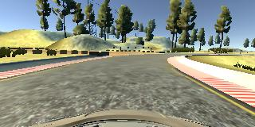

# Project: Behavioral Cloning

## Table of contents
1. [Overview](#overview)
2. [Visualization](visualization)
3. [Preprocessing](preprocessing)
3. [Model Architecture](architecture)
4. [Training](training)
5. [Testing Videos](videos)

Overview
---
The goal of this project is to collect the driving data with the simulator and to predict the steering angles to drive around the track autonomously.

Image Visualization
---

### Example images of Track1
* Central camera images 

* Left camera images

* Right camera images

The example images shows two normal images, one reverse lap image and one recovery position image.

### Example images of Track2
* Central camera images

* Left camera images

* Right camera images

The images shown above is one normal image and one recovery position image

Preprocessing
---
Images from central, left and right camera are first converted to `RGB color space` as the testing images in `drive.py` is loaded in RGB color space. These images are then cropped, normalized (divided by 255) and zero-centered (subtracted by 0.5) to obtain the input image for the first convolution layer.

Model Architecture
---
[Nvidia architecture](https://devblogs.nvidia.com/deep-learning-self-driving-cars/) is followed with slight modifications. Nvidia architecture used 5x5 kernel convolutions followed by 3x3 kernel convolutions. I have used first 3x3 convolutions and followed by 5x5 convolutions. The 3x3 convolution layers express more powerful features with less parameters.

| Layer | Description |
|:-----:|:-----------:|
| Cropping | Crop the image 40 pixels from the top and 20 pixels from the bottom. Input size: 320x160x3, Output size: 320x90x3 |
| Lambda | Lambda layer is added to normalize the image. In this layer each pixel of the image is divided by 255 and subtracted with 0.5 to make it zero-centered |
| Convolution | Convolution with ReLU activation. Input size: 320x90x3, Filter size: 6, Kernel size: 3x3, Stride: 2x2, Padding: Valid, Output size: 159x44x6 |
| Convolution | Convolution with ReLU activation. Input size: 159x44x6, Filter size: 18, Kernel size: 3x3, Stride: 2x2, Padding: Valid, Output size: 79x21x18 |
| Convolution | Convolution with ReLU activation. Input size: 79x21x18, Filter size: 36, Kernel size: 3x3, Stride: 2x2, Padding: Valid, Output size: 39x11x36 |
| Convolution | Convolution with ReLU activation. Input size: 39x11x36, Filter size: 48, Kernel size: 5x5, Stride: 1x1, Padding: Valid, Output size: 35x7x48 |
| Convolution | Convolution with ReLU activation. Input size: 35x7x48, Filter size: 64, Kernel size: 5x5, Stride: 1x1, Padding: Valid, Output size: 31x3x64 |
| Flatten | Output size: 5952 |
| Fully connected layer | Input size: 5952, Output size: 200 with ReLU |
| Fully connected layer | Input size: 200, Output size: 75 with ReLU |
| Fully connected layer | Input size: 75, Output size: 15 with ReLU |
| Fully connected layer | Input size: 15, Output size: 1 |

Training
---
Training data consisted of `30999` images in total out of which `11955` are of track1 and `19044` are of track2. These images are split in the ratio of 80% for training and 20% for validation.
So `24525` images were used for training and `6474` for validation.

For track1 - One lap of data is collected with smooth motion around the track, One lap with reverse direction and One lap in zig-zag manner trying to recover from the corners.

For track2 - Same steps are followed to the track2 as well with some additional training data in some tough turns.

All the 3 camera images are used with `0.12` correction factor for left and right images.

Model is trained with following parameters:
* Batch size: 32
* Loss: mse (Mean Squared Error)
* Optimizer: adam with default learning rate (0.001)
* Epochs: 7

Testing Videos
---

### Track1

### Track2
